# 📊 IBM Data Analyst Capstone Project
### Identifying Emerging Technology Trends for the IT Industry

---

## 📌 Table of Contents
- [Project Overview](#project-overview)
- [About the Dataset](#about-the-dataset)
- [Project Workflow](#project-workflow)
- [Key Findings](#key-findings)
- [Visualizations](#visualizations)
- [Recommendations](#recommendations)
- [Tools & Technologies Used](#tools--technologies-used)
- [How to Run This Project](#how-to-run-this-project)

---

## Project Overview

This project was completed as the final capstone for the **IBM Data Analyst Professional Certificate**. The goal was to act as a Data Analyst for a large IT consulting organization and help the company understand **what skills are currently in demand** and **what technologies are expected to grow** in the near future.

The analysis covers:
- Which programming languages developers are using today — and which ones they want to learn next
- Which databases are most popular — and which are gaining interest
- Where developers prefer to work
- How compensation varies by age and education level
- Which development tools (IDEs) are leading the industry

The findings from this project are intended to help business leaders, HR teams, and training departments make **data-driven decisions** about hiring, upskilling, and technology adoption.

---

## About the Dataset

The primary data source is the **Stack Overflow Developer Survey**, one of the largest and most comprehensive surveys of software developers in the world. Additional data was collected through web scraping and a Jobs API.

| Detail | Info |
|---|---|
| **Source** | Stack Overflow Developer Survey 2019 |
| **Hosted by** | IBM Cloud (Skills Network) |
| **Survey Respondents** | ~11,500+ developers globally |
| **Key Topics** | Programming languages, databases, IDEs, salary, education, work preferences |
| **Format** | CSV + SQLite database |

### Columns Used in This Analysis

| Column | What It Means |
|---|---|
| `ConvertedComp` | Annual salary converted to USD |
| `EdLevel` | Highest level of education completed |
| `Age` | Age of the respondent |
| `WorkLoc` | Preferred work location (Office / Home / Other) |
| `Employment` | Full-time, part-time, etc. |
| `Country` | Country of residence |
| `LanguageWorkedWith` | Programming languages currently used |
| `LanguageDesireNextYear` | Languages developers want to use next year |
| `DatabaseWorkedWith` | Databases currently used |
| `DatabaseDesireNextYear` | Databases developers want to use next year |
| `DevEnviron` | Development environments / IDEs used |

---

## Project Workflow

The project was completed in five structured stages:

```
Stage 1 → Web Scraping          Collected programming language salary data from the web
Stage 2 → Data Collection       Used a Jobs API to count job postings by technology and city
Stage 3 → Data Wrangling        Cleaned the data: removed duplicates, handled missing values
Stage 4 → Exploratory Analysis  Studied distributions, outliers, and relationships in the data
Stage 5 → Data Visualization    Built charts to clearly communicate all findings
```

---

## Key Findings

### 💻 Programming Languages
- **JavaScript** is the most widely used language today, followed by **HTML/CSS** and **SQL** — confirming web development as the dominant field.
- **Python** has climbed significantly in desired languages, now ranking **3rd** in what developers want to use next year — up from 5th in current usage. This reflects Python's growing role in data science, AI, and automation.
- **TypeScript** and **Go** are emerging as languages developers are keen to adopt, signalling a shift toward stronger typing and modern backend development.

### 🗄️ Databases
- **MySQL** is the most used database today, with over 5,500 respondents using it.
- However, when asked what database they want to use **next year**, developers ranked **PostgreSQL #1** — overtaking MySQL. This suggests a growing preference for open-source, feature-rich relational databases.
- **MongoDB** and **Redis** are rising fast in desired usage, reflecting increased interest in NoSQL and caching solutions.

### 🛠️ Development Tools (IDEs)
- **Visual Studio Code** is the overwhelming favourite, used by nearly 6,500+ respondents — more than any other tool by a significant margin.
- **Visual Studio**, **Notepad++**, and **IntelliJ** round out the top four.

### 💰 Salary Insights
- Developer salaries are **right-skewed** — the majority earn between **$0–$75,000**, but a long tail of high earners pulls the average upward.
- **Doctoral degree holders** tend to command the highest median salaries, followed by **Bachelor's degree** holders.
- Interestingly, some developers **without formal degrees** also earn competitive salaries, reflecting the industry's skills-first hiring culture.
- Salary increases with age but plateaus around the **40s**, with high variance at every age group.

### 🌍 Demographics
- The **United States** has the highest number of survey respondents (3,100+), followed by **India** and the **United Kingdom**.
- The vast majority of respondents (~97%) are **employed full-time**.
- **59.9% of developers prefer working from an office**, while **31.6% prefer working from home** — notable given this survey was from 2019, before the major remote work shift.

---

## Visualizations

### 1. Salary Distribution
> Most developers earn between $0–$75,000 annually. The distribution is right-skewed, meaning a small number of very high earners pull the average up.

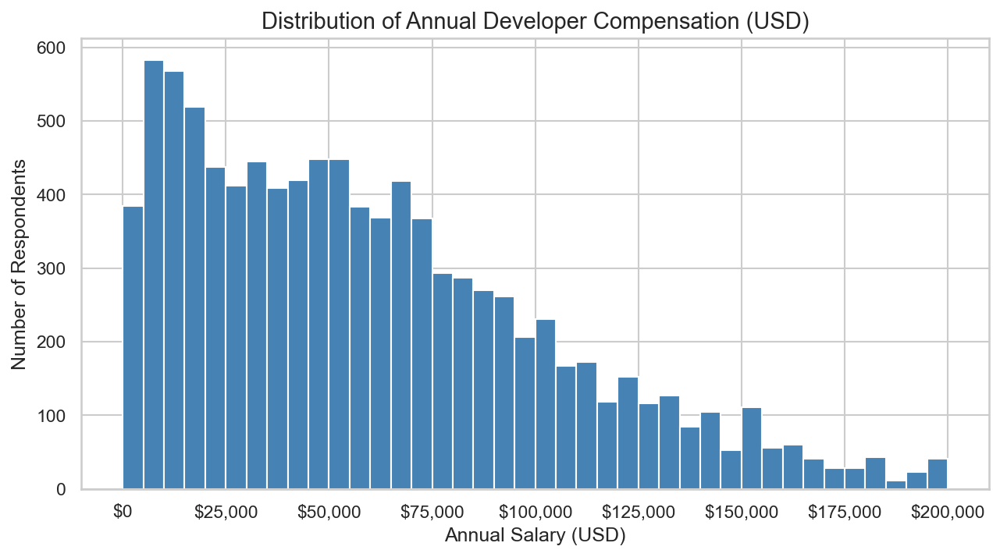

---

### 2. Salary by Education Level
> Doctoral degree holders tend to earn the most. However, the wide spread of each box shows that education level alone does not guarantee a higher salary — skills and experience also play a major role.

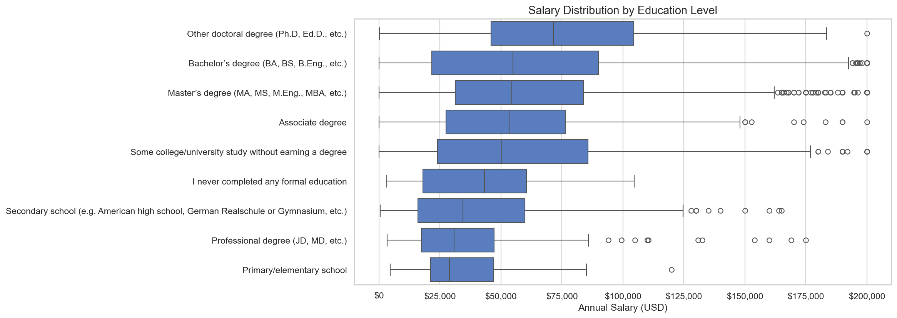

---

### 3. Top 10 Programming Languages Currently Used
> JavaScript leads by a wide margin, confirming its dominance in web development. SQL, Python, and Java remain strong foundations across all types of development work.

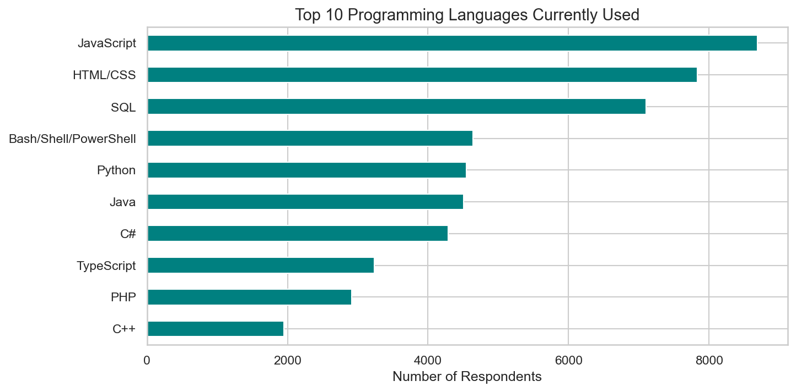

---

### 4. Top 10 Languages Developers Want to Use Next Year
> Python's jump to 3rd place signals strong future demand in data, AI, and automation. TypeScript and Go show growing appetite for modern, scalable languages.

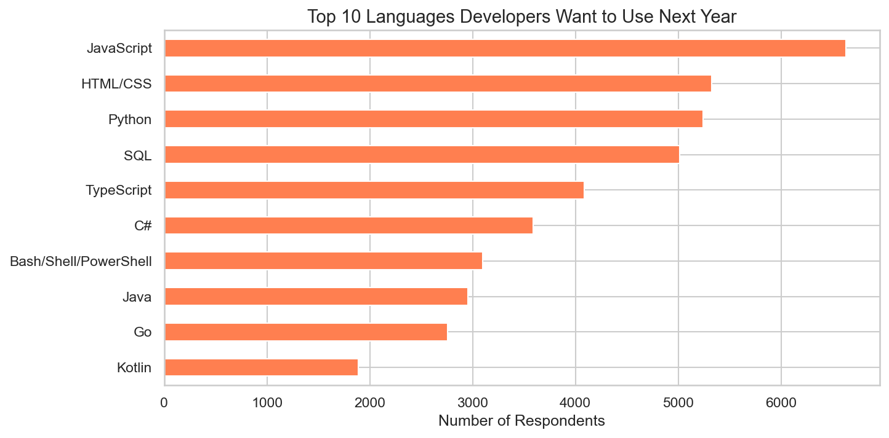

---

### 5. Top 10 Databases Currently Used
> MySQL dominates current usage. Microsoft SQL Server and PostgreSQL are nearly tied for second place, reflecting the continued strength of relational databases.

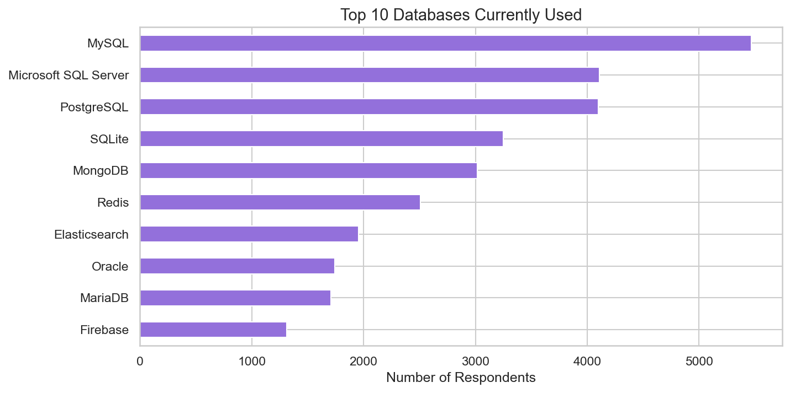

---

### 6. Top 10 Databases Developers Want Next Year
> PostgreSQL surpasses MySQL in desired usage — a clear indicator that developers are moving toward it for future projects. MongoDB and Redis reflect the growing NoSQL trend.

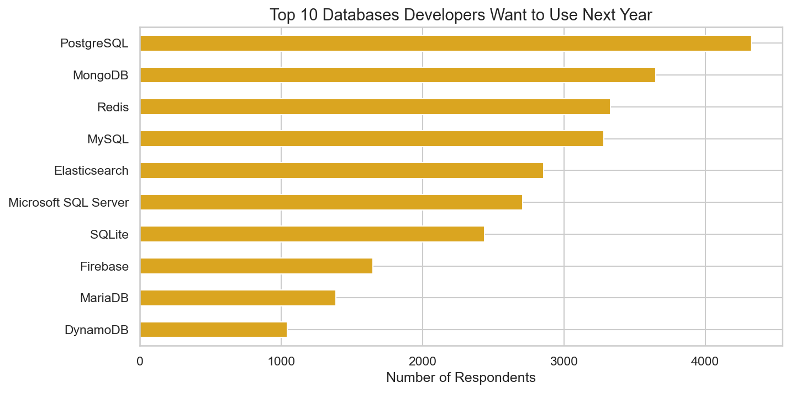

---

### 7. Work Location Preference
> Nearly 60% of developers still prefer working from an office (as of 2019). Home-based work at 31.6% was already significant, a figure that has grown substantially since the pandemic.

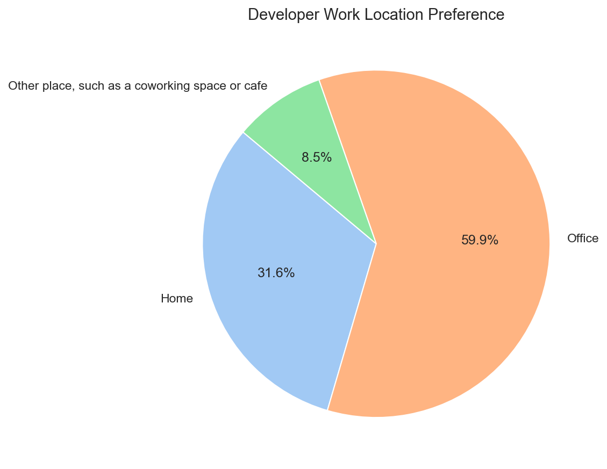

---

### 8. Age vs Annual Compensation
> Compensation generally increases with age, but there is extremely high variance at every age group — a 25-year-old and a 45-year-old can both earn $150,000 or more. Experience and specialisation matter more than age alone.

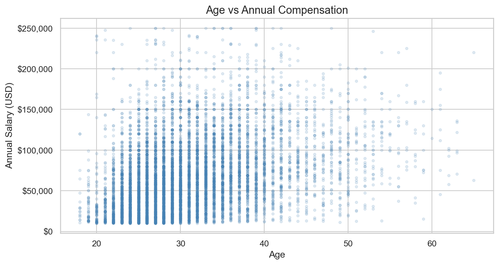

---

### 9. Top 10 IDEs / Development Environments
> Visual Studio Code is the undisputed leader. Its free, lightweight, and highly extensible nature makes it the go-to choice for developers across all languages.

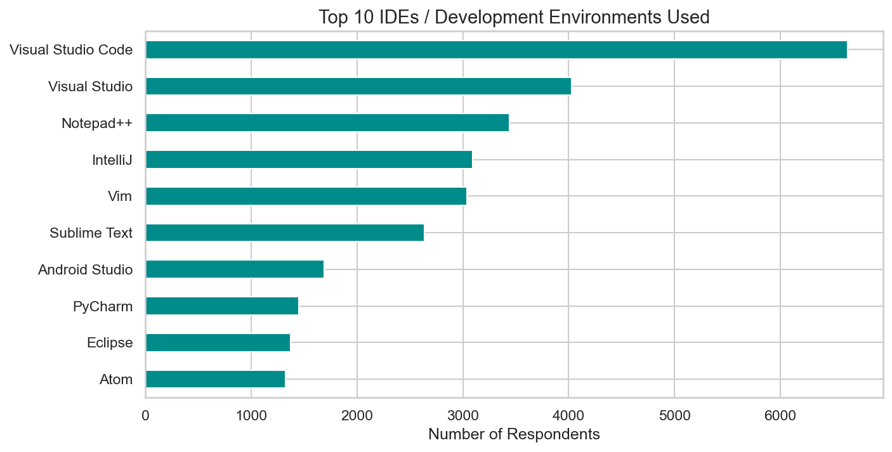

---

### 10. Top 10 Countries by Respondents
> The United States accounts for the largest share of respondents. The strong presence of India and UK highlights the global nature of the developer community.

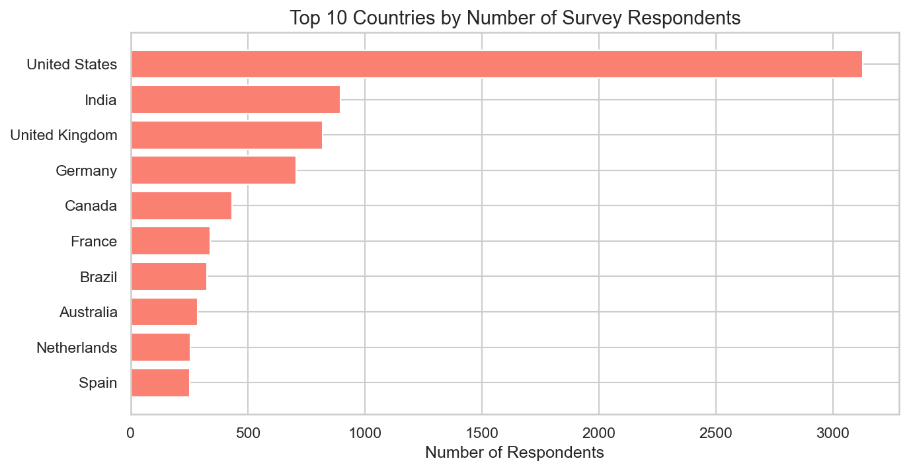

---

### 11. Employment Type
> Approximately 97% of survey respondents are employed full-time, indicating that software development remains a stable, full-time profession with very low part-time representation.

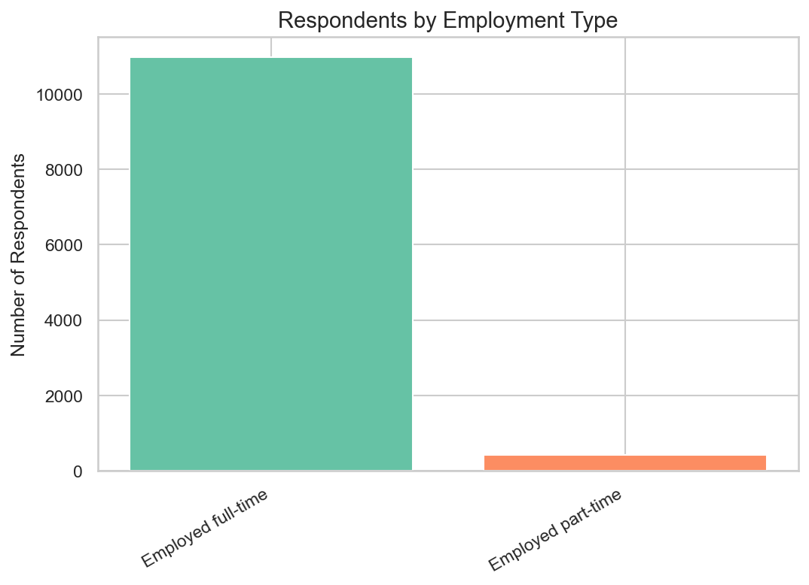

---

## Recommendations

Based on the analysis, here are actionable recommendations for the organization:

**1. Prioritize Python in Training Programs**
Python is already in the top 5 most used languages and is the #3 most desired language for next year. Investing in Python training — especially for data analysis, machine learning, and automation — will keep the workforce competitive.

**2. Transition Database Skills Toward PostgreSQL and MongoDB**
While MySQL is the current standard, PostgreSQL is the most desired database for next year. Organizations should begin upskilling teams in PostgreSQL for relational workloads and MongoDB for document-based/NoSQL scenarios.

**3. Standardize on Visual Studio Code**
VS Code is already the dominant IDE. Standardizing on it across teams reduces friction, improves collaboration, and benefits from its massive ecosystem of extensions.

**4. Don't Over-Index on Degrees When Hiring**
The salary data shows that developers without formal degrees can be equally high performers. Skills-based assessments and portfolio reviews should complement (or in some cases replace) degree requirements in hiring decisions.

**5. Revisit Remote Work Policy**
Even before the pandemic, nearly 1 in 3 developers preferred working from home. Post-2020, this preference has grown dramatically. Flexible and remote-first policies are essential to attracting top talent globally.

**6. Target Emerging Languages Early**
TypeScript, Go, and Kotlin are appearing in desired-language lists. Encouraging early adoption of these languages positions the organization ahead of the curve as these technologies mature.

---

## Tools & Technologies Used

| Tool | Purpose |
|---|---|
| **Python** | Core programming language for all analysis |
| **Pandas** | Data manipulation and cleaning |
| **NumPy** | Numerical operations |
| **Matplotlib** | Base charting library |
| **Seaborn** | Statistical visualizations |
| **BeautifulSoup** | Web scraping |
| **Requests** | API calls and HTTP requests |
| **SQLite / sqlite3** | Querying the survey database |
| **Jupyter Notebook** | Interactive development environment |
| **openpyxl** | Reading and writing Excel files |

---

## How to Run This Project

**1. Clone the repository**
```bash
git clone https://github.com/your-username/ibm-data-analyst-capstone.git
cd ibm-data-analyst-capstone
```

**2. Install dependencies**
```bash
pip install -r requirements.txt
```

**3. Run notebooks in order**

| Order | Notebook | What It Does |
|---|---|---|
| 1 | `01_web_scraping/web_scraping.ipynb` | Scrapes language salary data |
| 2 | `02_data_collection/data_collection.ipynb` | Collects job postings via API |
| 3 | `03_data_wrangling/data_wrangling.ipynb` | Cleans and prepares the data |
| 4 | `04_exploratory_data_analysis/eda.ipynb` | Statistical exploration |
| 5 | `05_data_visualization/data_visualization.ipynb` | Generates and saves all charts |

**4. Charts will be saved automatically** to the `images/` folder when you run notebook 5.

---

## 📁 Project Structure

```
IBM_Capstone_Project/
│
├── 01_web_scraping/
│   └── web_scraping.ipynb
│
├── 02_data_collection/
│   └── data_collection.ipynb
│
├── 03_data_wrangling/
│   └── data_wrangling.ipynb
│
├── 04_exploratory_data_analysis/
│   └── eda.ipynb
│
├── 05_data_visualization/
│   └── data_visualization.ipynb
│
├── images/                         ← All 11 charts saved here
│   ├── 01_salary_histogram.png
│   ├── 02_salary_by_education_boxplot.png
│   ├── 03_top10_languages_worked_with.png
│   ├── 04_top10_languages_desired.png
│   ├── 05_top10_databases_worked_with.png
│   ├── 06_top10_databases_desired.png
│   ├── 07_work_location_pie.png
│   ├── 08_age_vs_salary_scatter.png
│   ├── 09_top10_ides_used.png
│   ├── 10_top10_countries.png
│   └── 11_employment_type.png
│
├── data/                           ← CSVs and Excel files generated by notebooks
├── requirements.txt
└── README.md
```

---

*This project was completed as part of the IBM Data Analyst Professional Certificate on Coursera.*
